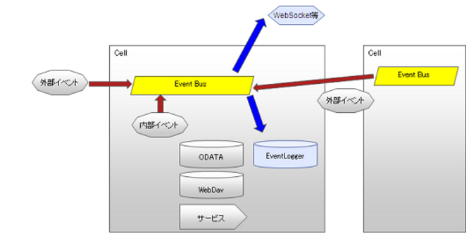

# イベントのモデル
## 概要
[イベント受付API](278_Event_Reception.md)にて定義された外部イベント、およびPersonium内部で定義された内部イベントから構成される。




#### 外部イベント
[イベント受付API](278_Event_Reception.md) にて、受け付けるイベントを表す。  
イベント受付APIによってイベントが発生し、受け付けたイベントは、イベントバスに出力される。
また、将来的には、他のセルに対するイベント受付のリレー処理が可能となる予定。  
#### 内部イベント
Personium内部で保持する管理データ（OData/WebDAV/Service等）の状態をもとに実行される処理のことを表す。  
代表的な内部イベントとして、Personium APIのリクエストがある。  
Personium APIのレスポンス返却時に実行結果をイベントとしてイベントバスに出力する。

## イベントの処理
イベントバスに出力されたイベントは、ルールの条件と合致するか判定され、合致した場合は、ルールに記述されたアクションを実行される。
アクションには、以下が指定可能。
* ログ出力
* スクリプト実行
* イベント中継

### イベントログフォーマット
イベントログは、以下のフォーマットで出力される。
* 日時
* リクエストキー
* 外部イベントフラグ
* Schema
* Subject
* Type
* Object
* Info

### イベントログアクセス方法
イベントログは、WebDAV上で管理するため、イベントログファイルへのアクセスはWebDAV用のAPIで行う。
* [ログファイル一覧取得](284_Retrieve_Log_File_list.md)
* [ログファイル取得](285_Retrieve_Log_File.md)
* [ログファイル削除](286_Delete_Log_File.md)

### イベントログ保管期間
イベント量に応じてイベントログファイルのサイズが増大するため、一定量にてイベントログファイルをローテートする。  
ローテートされたイベントログファイルの保持世代数は、最大12世代とする。  
なお、ローテート時の最大サイズは、デフォルト50MBとし、ログ設定更新APIにて設定可能とする。
### 出力例
#### 外部イベントの出力例
```
2013-04-18 14:52:39.778,[ERROR],"Req_animal-access_1001","true",
"https://{UnitFQDN}/appCell/","https://{UnitFQDN}/servicemanager/#admin","actionData",
"/svc/token_keeper","resultData"
2013-04-18 14:52:40.688,[INFO ],"Req_animal-access_2001","true",
"https://{UnitFQDN}/appCell/","https://{UnitFQDN}/servicemanager/#admin","action",
"/svc/token_keeper","result"
2013-04-18 15:01:46.994,[INFO ],"Req_animal-access_2001","true",
"https://{UnitFQDN}/appCell/","https://{UnitFQDN}/servicemanager/#admin","action",
"/svc/token_keeper","result"
2013-04-18 15:06:19.294,[ERROR],"Req_animal-access_1001","true",
"https://{UnitFQDN}/appCell/","https://{UnitFQDN}/servicemanager/#admin","actionData",
"/svc/token_keeper","resultData"
2013-04-18 15:06:23.360,[INFO ],"Req_animal-access_2001","true",
"https://{UnitFQDN}/appCell/","https://{UnitFQDN}/servicemanager/#admin","action",
"/svc/token_keeper","result"
2013-04-18 15:09:18.073,[ERROR],"Req_animal-access_1001","true",
"https://{UnitFQDN}/appCell/","https://{UnitFQDN}/servicemanager/#admin","actionData",
"/svc/token_keeper","resultData"
```
#### 内部イベントの出力例
```
2013-04-18 14:52:39.779,[INFO ],"Req_animal-access_1001","false",
"https://{UnitFQDN}/appCell/","https://{UnitFQDN}/appCell/#staff","odata.update",
"https://{UnitFQDN}/homeClinic/box/col/put_blog","204"
2013-04-18 14:52:39.780,[INFO ],"Req_animal-access_1001","false",
"https://{UnitFQDN}/appCell/","https://{UnitFQDN}/appCell/#staff","odata.get",
"https://{UnitFQDN}/homeClinic/box/col/blog_20130418","200"
```
